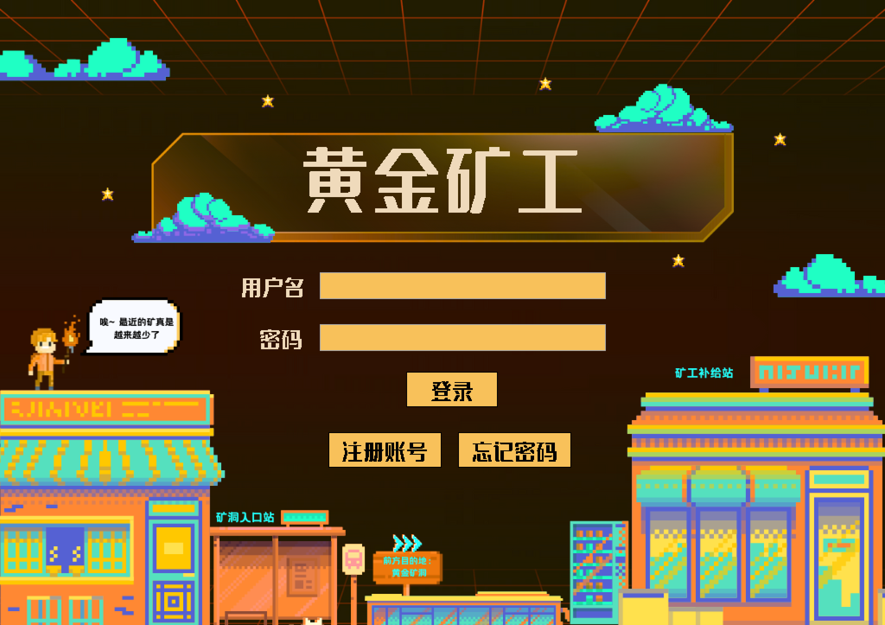
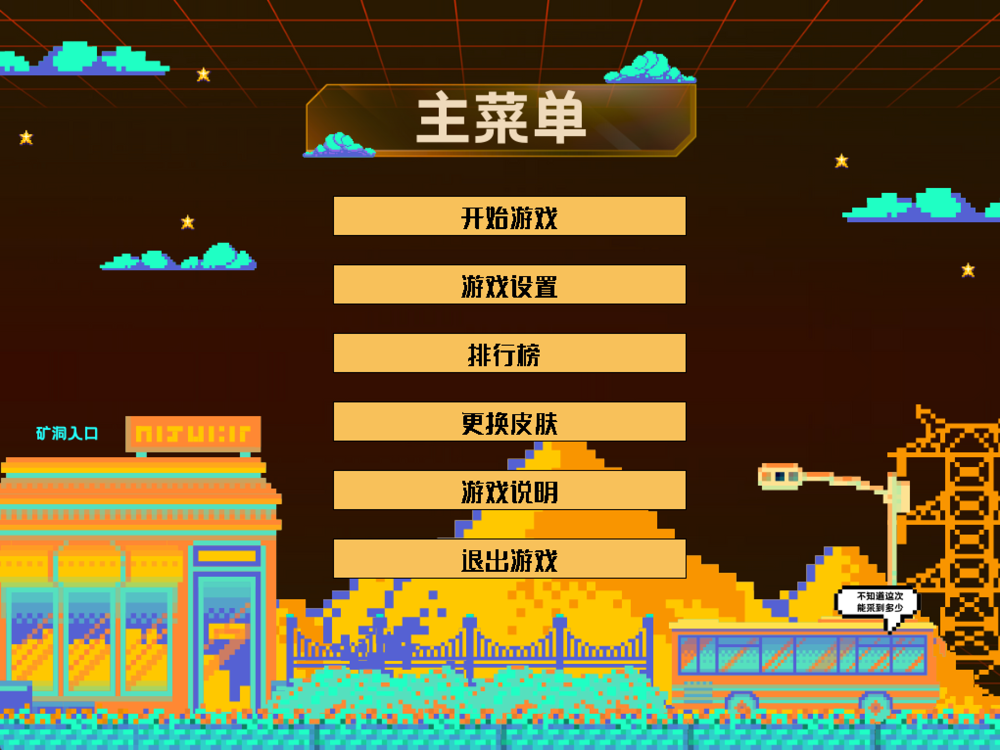
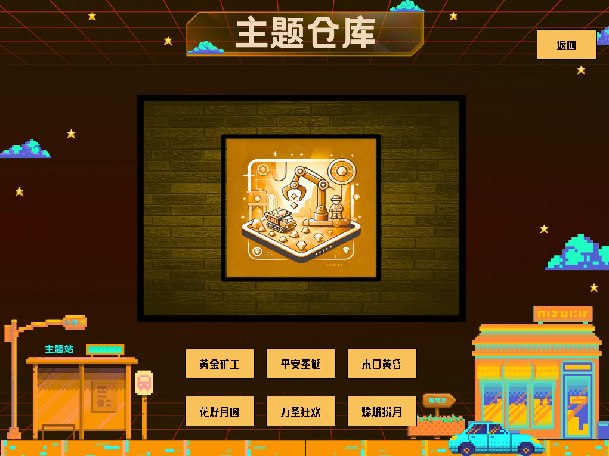
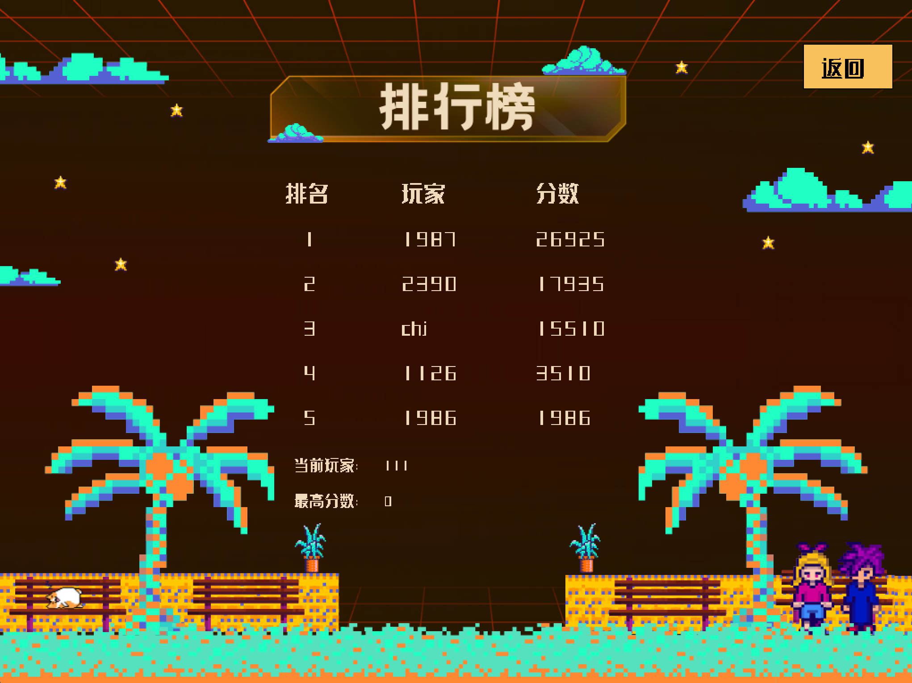
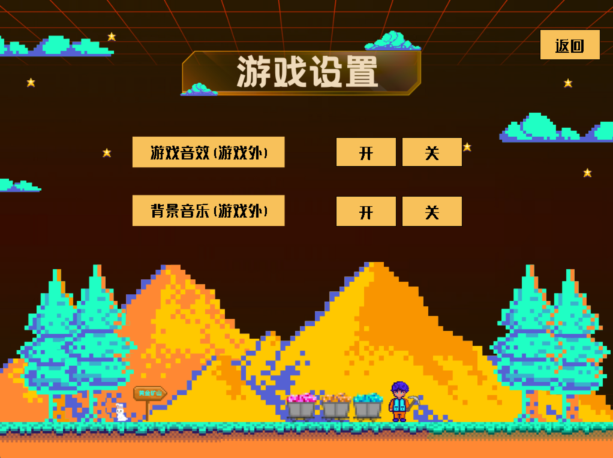
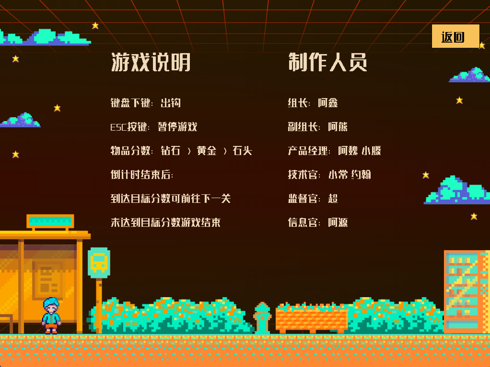

# 黄金矿工（Gold Miner）

一款复古像素风格的挖矿游戏，使用 **C++** 语言结合 **EasyX 图形库** 独立开发完成。  

---

## 游戏预览

| 登录界面 | 主菜单 | 主题皮肤库 |
|----------|--------|-------------|
|  |  |  |

| 排行榜 | 设置界面 | 游戏说明 |
|--------|----------|----------|
|  |  |  |

---

## 技术栈（Tech Stack）

| 技术组件 | 描述说明 |
|----------|----------|
| `C++` | 游戏核心逻辑与文件 I/O 处理 |
| `EasyX` | 2D 图形渲染与用户输入处理 |
| `.mp3` | 背景音乐与音效播放 |
| `自定义资源` | 像素风 UI 与角色素材设计 |

---

## 项目结构

```bash
├── .gitignore                   # Git 忽略文件配置
├── LICENSE                      # 开源许可证
├── README.md                    # 项目说明文档
├── UpgradeLog.htm               # VS 项目升级日志（可选）
├── goldMiner.sln                # Visual Studio 解决方案文件
├── goldMiner/                   # 主项目目录
│   ├── assets/                  # 素材资源（图像、音效等）
│   ├── Debug/                   # 编译输出（已忽略）
│   ├── x64/                     # 编译输出（已忽略）
│   ├── EasyText.h               # EasyX 配置头文件
│   ├── font.ttf                 # 自定义字体
│   ├── gameExplain.mp3          # 音效 - 游戏说明
│   ├── gameLogin.mp3            # 音效 - 登录界面
│   ├── gameMenu.mp3             # 音效 - 主菜单
│   ├── gameRank.mp3             # 音效 - 排行榜
│   ├── gameSkin.mp3             # 音效 - 皮肤界面
│   ├── main.cpp                 # 游戏主入口
│   ├── tools.h                  # 工具函数集合
│   ├── userdata.txt             # 用户数据（如分数）本地持久化存储
│   ├── 黄金矿工.vcxproj           # VS 项目文件
│   ├── 黄金矿工.vcxproj.filters   # VS 项目过滤器
│   └── 黄金矿工.vcxproj.user      # VS 用户配置文件
├── preview/                     # README 用预览截图
├── Setup1/                      # 安装包相关文件（可选）
└── x64/                         # 构建输出目录（重复，可忽略）
```

---

## 游戏特性

- 键盘操作控制钩爪（按 `↓` 放下钩子）
- 登录与本地账户系统
- 支持背景音乐及音效（可开关）
- 多套皮肤与主题可选
- 本地排行榜（分数持久化保存）
- ⏱游戏计时器与目标得分机制，支持关卡推进

---

## 运行方式（仅支持 Windows）

1. 使用 Visual Studio 打开 `GoldMiner.sln`
2. 确保已正确安装 EasyX 图形库
3. 编译并运行 `main.cpp`
4. 使用键盘与鼠标进行游戏交互

---

## 简历描述参考（Resume-Friendly）

- 从零使用 C++ + EasyX 独立开发完成完整 2D 像素风游戏
- 实现用户登录验证、多界面跳转与本地文件数据存储
- 构建模块化架构：登录、菜单、皮肤选择、排行榜与主循环逻辑
- 集成音效与主题 UI，增强用户沉浸感与交互体验

---

## 未来优化方向

- 加入道具系统（如炸弹、加速器等）
- 多样化关卡设计与障碍物
- 引入 SQLite 或云端排行榜系统
- 替换 EasyX，迁移至现代框架（如 SFML、SDL 等）

---
